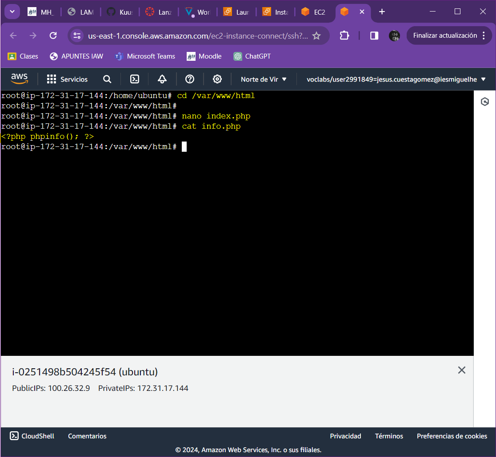

# Actividad-1.3.1: Instalación de la pila LAMP (Linux, apache, MariaDB y PHP) en una instancia EC2 de AWS con Debian Server.

## APACHE2 Y PHP:

### Actualizamos los repositorios e intalamos Apache2:

### Instalamos PHP:

### Buscamos en la ruta el sitio web por defecto (000-default.conf) y lo editamos añadiendo la la orden DirectoryIndex(Indicando la pagina php por defecto):

### Reiniciamos el servicio de Apache2 mediante el comando systemctl restart apache2 si quisieramos comprobar su estado lo hariamos mediante el comando "systemctl status apache2":

### Comprobacion de LAMP stack:

### Desde el navegador e incluimos la siguiente URL: http://ip_servidor/info.php

## MARIADB:

### Actualizamos los repositorios e instalación servidor de base de datos y cliente:

### Acceso a MariaDB desde consola servidor (como root):

### Cambiar la contraseña de root:

## PHPMYADMIN:

### Instalamos PHPMyadmin:

### Durante la instalacion de PHPMyadmin debemos escoger la opcion de apache2:

### Confirma que desea utilizar dbconfig-common para configurar la base de datos:

### Capturas de las opciones que se deben seguir durante el proceso de instalacion:

### Accedemos a PHPMyAdmin desde el navegador: http://ip_host/phpmyadmin/

### Esto es lo que se ve una vez dentro de PHPMyadmin:

### Contenido de los ficheros index.php e info.php

