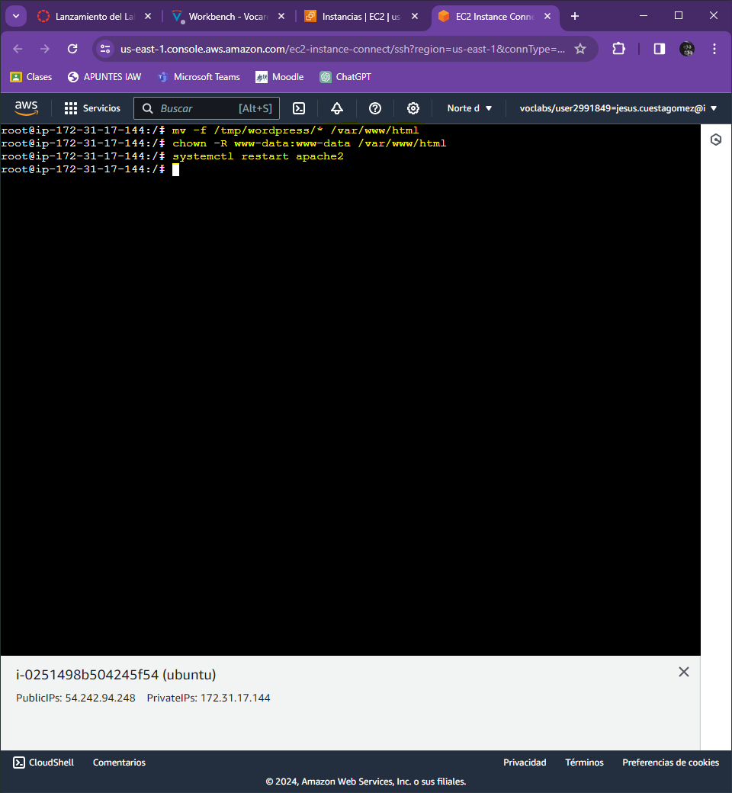
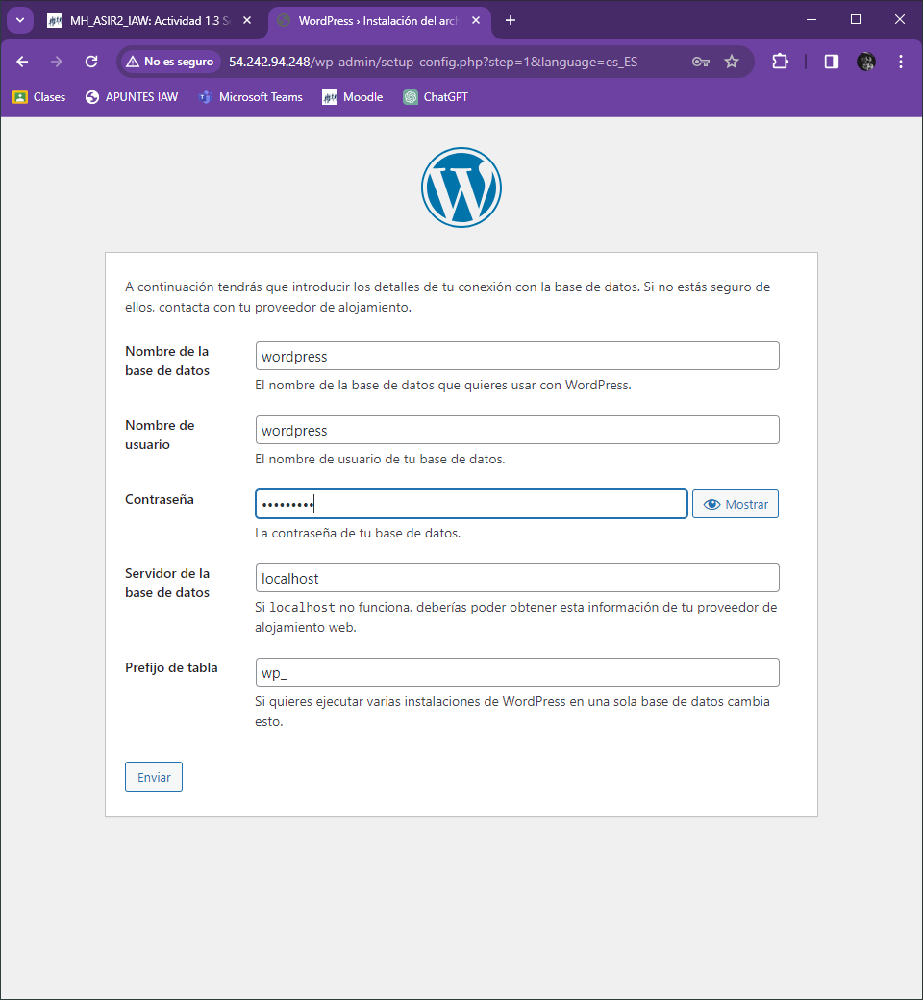
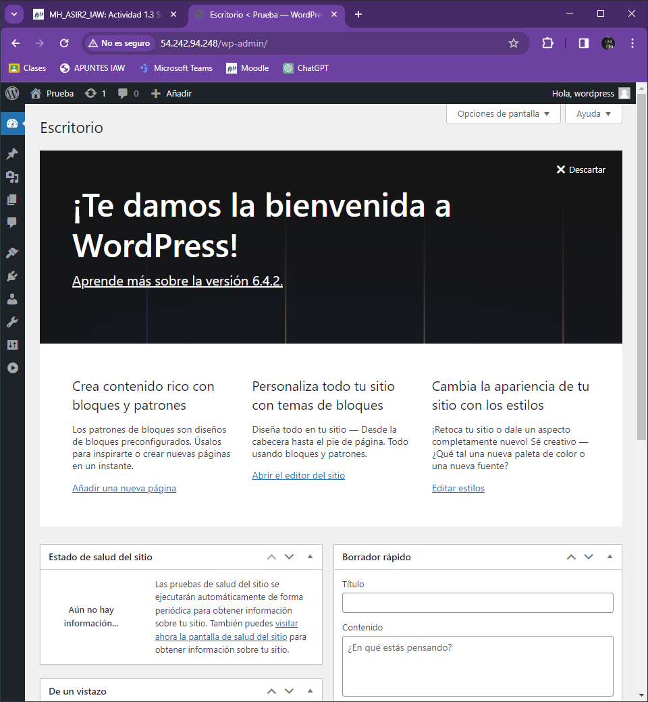

# Actividad 1.3.2:  Instalación de WordPress en una instancia EC2 de AWS.

### Instalamos de paquetes php necesarios:

### Creamos y configuramos de la base de datos:

### Configuramos del sitio por defecto de Apache2:

### Activamos el mod_rewrite para utilizar la función de permalink o enlace permanente de WordPress y reiniciamos el servidor web Apache2:

### Instalamos el paquete wget y utilizamos el comando wget seguido del enlace de descarga de WordPress:

### Una vez que hayamos descargado el archivo comprimido, instalamos la utilidad de descompresión unzip:

###  Movemos el contenido de /tpm/wordpress a /var/www/html, cambiamos el usuario propietario del documentRoot y reiniciamos el servicio Apache2:

### Terminamos la configuracion de Wordpress en la web para ello abrimos un navegador web y escribe la dirección IP del servidor http://ip_servidor/:

### Iniciamos sesion en Wordpress:

