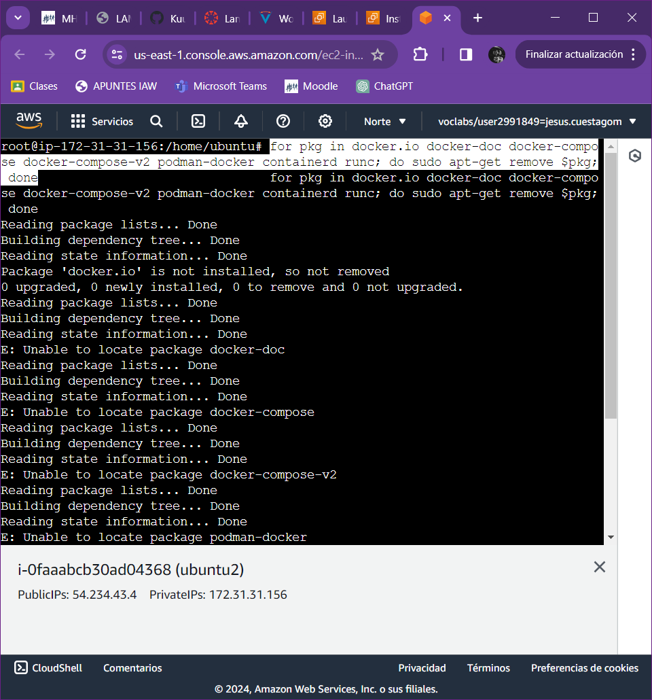
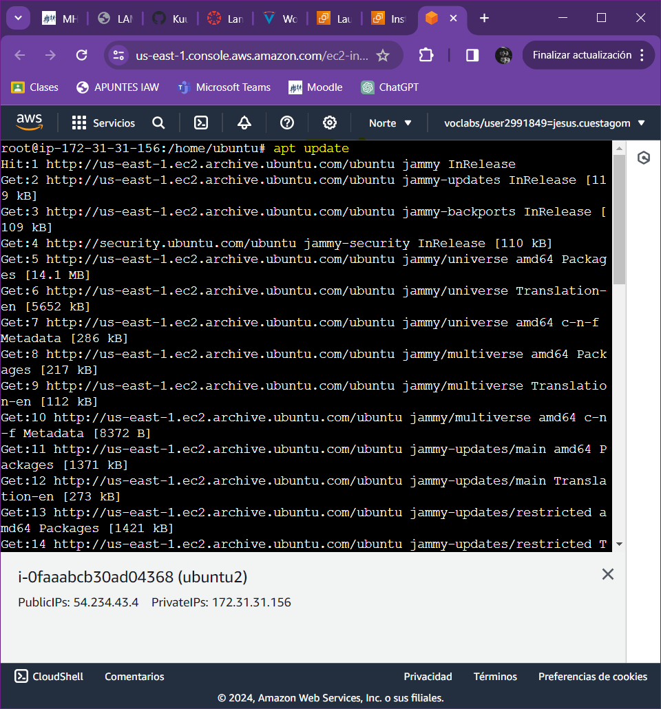
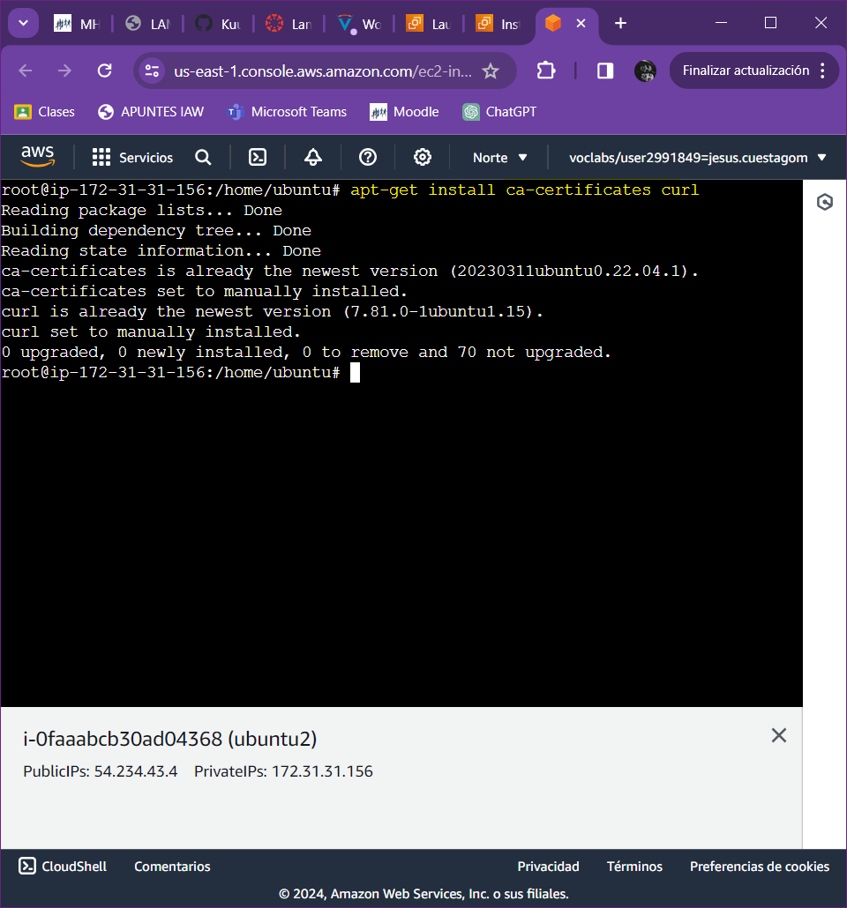
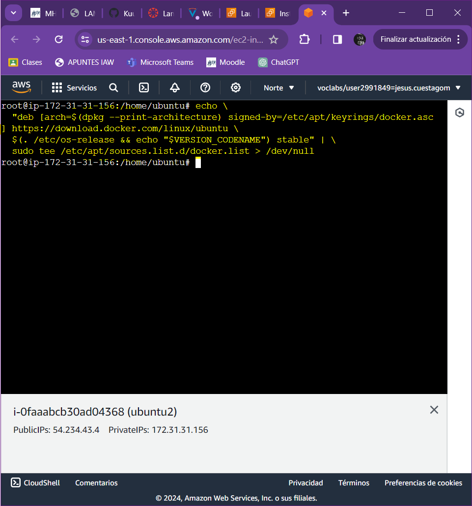
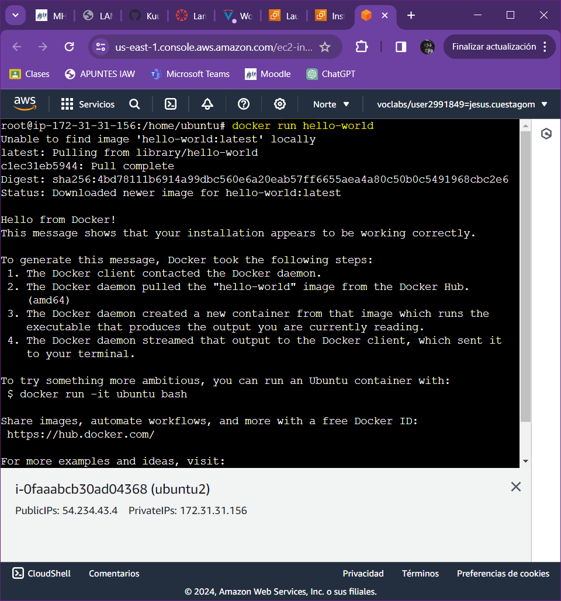
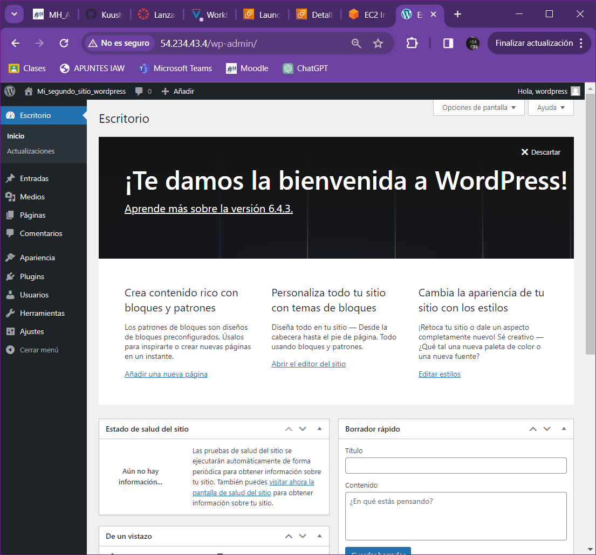

# Actividad 1.3.3: Instalación de WordPress usando contenedores Docker y Docker Compose.

### Creamos una maquina ubuntu nueva:

### Desistalamos algunos paquetes que pueden entrar en conflicto: 

### Añadimos la GPG key oficial de Docker:

### Añadimos el repositorio a Apt sources:

### Actualizamos el equipo:

### Instalamos el motor de Docker:

### Comprobamos la instalacion de Docker:

### Comprobamos la instalacion de Docker-Compose:

### Agregamos nuestro usuario al grupo de Docker:

### Comprobamos que se añadio correctamente:

### Intalamos el paquete git:

### Clonamos nuestro repositorio de Github:

### Con este comando ejecutamos el fichero config.yml:

### Copiamos la ip publica de la maquina:

### Accedemos desde el navegador a Wordpress y terminamos de configurarlo: 

### Fichero de configuracion docker-compose.yml

